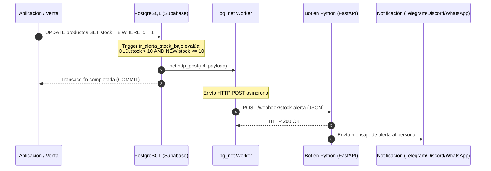

# 🤖 Integración del Bot de Alertas de Stock Bajo (Supabase + Python)

Este repositorio contiene la base de datos de **CoffeeFaster**, incluyendo la lógica de disparadores (Triggers) y Webhooks nativos mediante la extensión `pg_net` de Supabase para enviar alertas en tiempo real a un bot en Python cuando los productos alcanzan un nivel crítico de stock.

---

## 📋 Índice
1. [Arquitectura de la Integración](#-arquitectura-de-la-integración)
2. [Tipo de Conexión para el Bot](#-tipo-de-conexión-para-el-bot)
   - [A. Recepción de Eventos (Webhook Inbound)](#a-recepción-de-eventos-webhook-inbound)
   - [B. Conexión a la Base de Datos (Outbound / Opcional)](#b-conexión-a-la-base-de-datos-outbound--opcional)
3. [Estructura de Datos del Webhook (Payload JSON)](#-estructura-de-datos-del-webhook-payload-json)
4. [Lógica Antispam del Trigger](#-lógica-antispam-del-trigger)
5. [Guía Paso a Paso: Cómo Trabajar con el Bot en Python](#-guía-paso-a-paso-cómo-trabajar-con-el-bot-en-python)
   - [1. Instalación de Dependencias](#1-instalación-de-dependencias)
   - [2. Código del Bot (FastAPI)](#2-código-del-bot-fastapi)
   - [3. Configurar la URL en la Base de Datos](#3-configurar-la-url-en-la-base-de-datos)
   - [4. Prueba del Flujo Completo](#4-prueba-del-flujo-completo)
6. [Monitoreo y Diagnóstico](#-monitoreo-y-diagnóstico)

---

## 🏗 Arquitectura de la Integración



---

## 🔌 Tipo de Conexión para el Bot

Para trabajar con el bot se contemplan dos tipos de interacción de red:

### A. Recepción de Eventos (Webhook Inbound) - **Requerido**
El bot debe actuar como un **servidor HTTP/HTTPS** (por ejemplo, con FastAPI o Flask) con un endpoint dedicado a recibir las peticiones `POST` enviadas por PostgreSQL vía `pg_net`.

#### Direccionamiento según el entorno:
* **Entorno de Desarrollo Local (Supabase CLI en Docker):**
  * Supabase corre dentro de contenedores Docker. Si tu bot de Python corre directamente en tu máquina anfitriona (host), la base de datos **no puede** conectarse a `http://localhost:8000` (ya que `localhost` para el contenedor es él mismo).
  * En Docker se utiliza el DNS especial del host:  
    `http://host.docker.internal:8000/webhook/stock-alerta`
  * Si estás en Linux y `host.docker.internal` no resuelve directamente, puedes usar la IP del bridge de Docker (frecuentemente `http://172.17.0.1:8000/...`) o un túnel como Ngrok / Cloudflare Tunnels.
* **Entorno de Producción (Supabase Cloud):**
  * Tu bot debe estar alojado en un servicio con IP pública o dominio y certificado SSL válido:  
    `https://mi-bot.tudominio.com/webhook/stock-alerta`

### B. Conexión a la Base de Datos (Outbound / Opcional)
Si el bot necesita realizar consultas adicionales o actualizar registros (por ejemplo, registrar la alerta en la tabla `alertas_stock` o marcarla como leída):

1. **Vía Supabase Python SDK (Recomendada):**
   - Protocolo: REST sobre HTTPS.
   - Paquete: `supabase` (`pip install supabase`).
   - Usa las credenciales `SUPABASE_URL` y `SUPABASE_SERVICE_ROLE_KEY`.
2. **Vía Conexión Directa SQL / Pooler:**
   - Protocolo: PostgreSQL TCP estándar.
   - Librería: `asyncpg` o `psycopg2`.
   - Puerto local: `54322` (o pooler `54329`).
   - Puerto remoto Supabase: `5432` (Directo) o `6543` (Transaction Pooler).

---

## 📦 Estructura de Datos del Webhook (Payload JSON)

Cada vez que se active la condición de alerta, Supabase enviará un cuerpo JSON con la siguiente estructura:

```json
{
  "evento": "ALERTA_STOCK_BAJO",
  "producto": {
    "id": 15,
    "nombre": "Café Capuchino Mediano",
    "stock_actual": 8,
    "stock_anterior": 14,
    "stock_minimo_configurado": 5,
    "cafeteria_id": 2
  },
  "umbral_disparo": 10,
  "timestamp": "2026-09-12T22:45:10.123456Z"
}
```

### Descripción de Campos

| Campo | Tipo | Descripción |
| :--- | :--- | :--- |
| `evento` | `string` | Identificador del evento (`ALERTA_STOCK_BAJO`). Permite multiplexar eventos si agregas más triggers en el futuro. |
| `producto.id` | `bigint` | ID único del producto en la tabla `productos`. |
| `producto.nombre` | `string` | Nombre comercial del producto. |
| `producto.stock_actual` | `integer` | Nivel de inventario tras la última venta o ajuste (`NEW.stock`). |
| `producto.stock_anterior`| `integer` | Nivel de inventario antes de la actualización (`OLD.stock`). |
| `producto.stock_minimo_configurado` | `integer` | Stock mínimo definido en la ficha del producto (`stock_minimo`). |
| `producto.cafeteria_id` | `bigint` | ID de la cafetería a la que pertenece el producto. |
| `umbral_disparo` | `integer` | Valor umbral que disparó la alerta (por defecto `10`). |
| `timestamp` | `string` | Fecha y hora UTC del evento en formato ISO 8601. |

---

## 🛡 Lógica Antispam del Trigger

El trigger implementa una validación estricta de cambio de umbral:

$$\text{Disparar si y solo si: } \text{OLD.stock} > 10 \quad \land \quad \text{NEW.stock} \le 10$$

### Comportamiento ante cambios sucesivos:
* **Venta $14 \to 9$**: ✅ **Se envía el Webhook** (Cruzó el umbral de 10 hacia abajo).
* **Venta $9 \to 8$**: ❌ **No se envía** (`OLD.stock` ya era $\le 10$).
* **Venta $8 \to 0$**: ❌ **No se envía** (Evita saturar al bot con múltiples mensajes de un producto que ya fue alertado).
* **Reabastecimiento $0 \to 25$**: ❌ **No se envía** (El stock subió).
* **Nueva venta $25 \to 10$**: ✅ **Se vuelve a enviar** (El ciclo se reinició).

---

## 🚀 Guía Paso a Paso: Cómo Trabajar con el Bot en Python

### 1. Instalación de Dependencias

Crea un entorno virtual e instala las dependencias necesarias:

```bash
python3 -m venv venv
source venv/bin/activate
pip install fastapi uvicorn pydantic requests
```

### 2. Código del Bot (`bot_server.py`)

A continuación se muestra una implementación en **FastAPI** con validación de tipos mediante **Pydantic**:

```python
from fastapi import FastAPI, HTTPException, status
from pydantic import BaseModel
from datetime import datetime

app = FastAPI(
    title="CoffeeFaster - Stock Alert Bot",
    version="1.0.0"
)

# Definición del esquema recibido
class ProductoData(BaseModel):
    id: int
    nombre: str
    stock_actual: int
    stock_anterior: int
    stock_minimo_configurado: int
    cafeteria_id: int

class AlertaStockPayload(BaseModel):
    evento: str
    producto: ProductoData
    umbral_disparo: int
    timestamp: datetime

@app.post("/webhook/stock-alerta", status_code=status.HTTP_200_OK)
async def recibir_alerta_stock(payload: AlertaStockPayload):
    prod = payload.producto
    
    print(f"\n🚨 [ALERTA DE STOCK] -----------------------------")
    print(f"Cafetería ID : {prod.cafeteria_id}")
    print(f"Producto     : {prod.nombre} (ID: {prod.id})")
    print(f"Stock Actual : {prod.stock_actual} (Antes: {prod.stock_anterior})")
    print(f"Umbral       : {payload.umbral_disparo}")
    print(f"Fecha/Hora   : {payload.timestamp}")
    print(f"--------------------------------------------------\n")

    # Aquí integras el canal de salida:
    # - Bot de Telegram (usando telegram-bot API)
    # - Webhook de Discord
    # - Notificación Push (Firebase Cloud Messaging usando tokens de dispositivos)
    # - Correo o SMS
    
    return {
        "status": "success",
        "message": f"Alerta procesada para {prod.nombre}"
    }

if __name__ == "__main__":
    import uvicorn
    uvicorn.run("bot_server:app", host="0.0.0.0", port=8000, reload=True)
```

Para iniciar el servidor:

```bash
python bot_server.py
```

---

### 3. Configurar la URL en la Base de Datos

En la migración `supabase/migrations/0004_trigger_alerta_stock_bajo.sql`, reemplaza el marcador de posición por tu URL real.

Por ejemplo, si estás desarrollando en local:

```sql
PERFORM net.http_post(
    url := 'http://host.docker.internal:8000/webhook/stock-alerta',
    headers := jsonb_build_object(
        'Content-Type', 'application/json',
        'User-Agent', 'Supabase-pg_net-StockNotifier/1.0'
    ),
    body := v_payload,
    timeout_milliseconds := 5000
);
```

Para aplicar una actualización directa en la función sin regenerar toda la migración:

```bash
docker exec -i supabase_db_db_CoffeeFaster psql -U postgres -d postgres -c "
CREATE OR REPLACE FUNCTION notificar_stock_bajo()
RETURNS TRIGGER
LANGUAGE plpgsql
SECURITY DEFINER
SET search_path = public, net, extensions
AS \$\$
DECLARE
    v_umbral CONSTANT INTEGER := 10;
    v_payload JSONB;
BEGIN
    IF OLD.stock IS NOT NULL 
       AND NEW.stock IS NOT NULL 
       AND OLD.stock > v_umbral 
       AND NEW.stock <= v_umbral THEN

        v_payload := jsonb_build_object(
            'evento', 'ALERTA_STOCK_BAJO',
            'producto', jsonb_build_object(
                'id', NEW.id,
                'nombre', NEW.nombre,
                'stock_actual', NEW.stock,
                'stock_anterior', OLD.stock,
                'stock_minimo_configurado', NEW.stock_minimo,
                'cafeteria_id', NEW.cafeteria_id
            ),
            'umbral_disparo', v_umbral,
            'timestamp', timezone('utc', clock_timestamp())
        );

        PERFORM net.http_post(
            url := 'http://host.docker.internal:8000/webhook/stock-alerta',
            headers := jsonb_build_object(
                'Content-Type', 'application/json',
                'User-Agent', 'Supabase-pg_net-StockNotifier/1.0'
            ),
            body := v_payload,
            timeout_milliseconds := 5000
        );

    END IF;

    RETURN NEW;
END;
\$\$;
"
```

---

### 4. Prueba del Flujo Completo

1. Asegúrate de tener al menos un producto con stock superior a 10 (ej. 15):
   ```sql
   UPDATE productos SET stock = 15 WHERE id = 1;
   ```
2. Simula una venta que reduzca el stock por debajo del umbral:
   ```sql
   UPDATE productos SET stock = 8 WHERE id = 1;
   ```
3. Revisa la terminal donde se ejecuta `bot_server.py`. Deberías ver la alerta impresa en pantalla inmediatamente.
4. Intenta reducir nuevamente el stock de 8 a 5:
   ```sql
   UPDATE productos SET stock = 5 WHERE id = 1;
   ```
   Comprobarás que el bot **no** recibe nada gracias a la condición antispam.

---

## 🔍 Monitoreo y Diagnóstico

Si el bot no recibe las alertas, puedes inspeccionar las peticiones encoladas por `pg_net` directamente en PostgreSQL:

```sql
-- Consultar el historial de peticiones HTTP enviadas por pg_net
SELECT 
    id,
    url,
    method,
    status_code,
    error_msg,
    created
FROM net._http_response
ORDER BY created DESC
LIMIT 10;
```

* Si `error_msg` contiene `Couldn't connect to server`: Revisa que la URL use `host.docker.internal` y que el servidor de Python esté activo en el puerto 8000.
* Si `status_code` es `200`: La petición fue entregada con éxito al bot.
