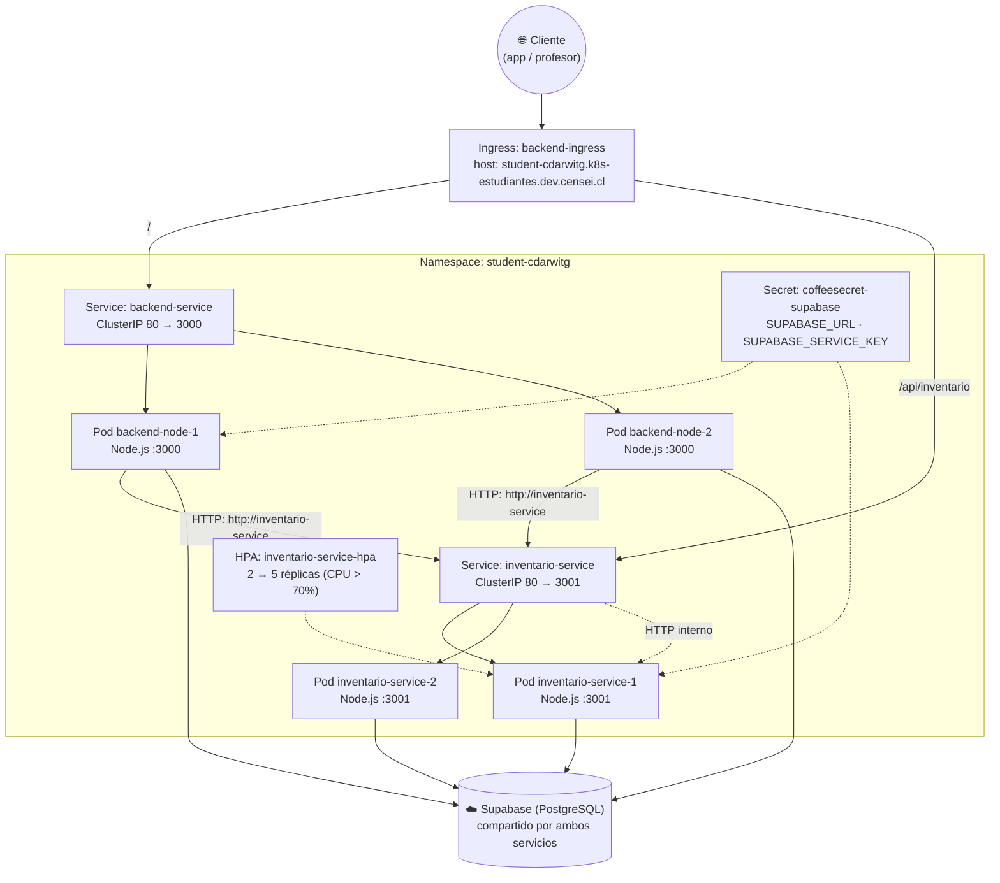
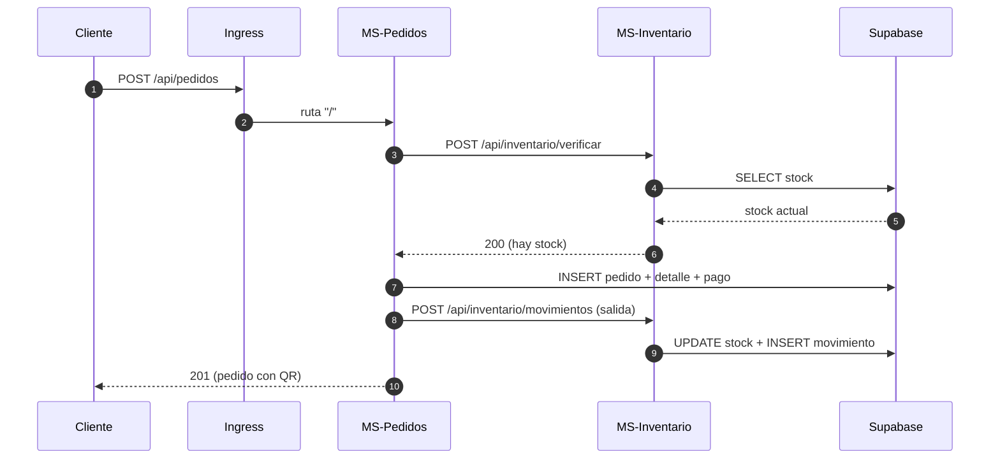
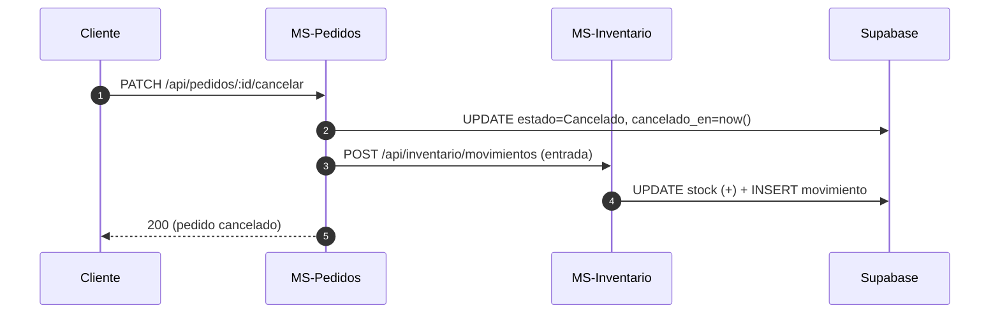

# Arquitectura de Microservicios — CoffeeFast

Este documento explica la arquitectura de microservicios desplegada en el clúster
Kubernetes institucional: **qué servicios existen, por qué están separados, cómo se
comunican y cómo se despliega cada uno**.

Para el paso a paso de despliegue (build, push, `kubectl apply`) ver
[`despliegue_kubernetes_backend.md`](./despliegue_kubernetes_backend.md).

---

## 1. Resumen del Despliegue

El sistema se despliega como **2 microservicios independientes**, cada uno con su
propio contenedor, su propio Deployment y su propio Service. Se comunican **por HTTP
dentro del clúster** usando el nombre del Service como hostname.

| | MS-Pedidos | MS-Inventario |
|---|---|---|
| **Nombre del recurso** | `backend-node` | `inventario-service` |
| **Código fuente** | `backend-node/` | `inventario-service/` |
| **Imagen** | `cdarwitg2024/backend-node:v1.0.4` | `cdarwitg2024/inventario-service:v1.0.1` |
| **Puerto del contenedor** | 3000 | 3001 |
| **Service (ClusterIP)** | `backend-service` 80 → 3000 | `inventario-service` 80 → 3001 |
| **Réplicas** | 2 | 2 (mín) → 5 (máx, HPA) |
| **Probes** | `readiness` + `liveness` en `/health` | `readiness` + `liveness` en `/health` |
| **Límites de recursos** | 125m/250m CPU · 128Mi/256Mi RAM | 125m/250m CPU · 128Mi/256Mi RAM |
| **Health** | `GET /health` | `GET /health` |
| **Tests** | 36 tests (`npm test`) | 11 tests (`npm test`) |

Ambiente: namespace `student-cdarwitg` del clúster `k8s-estudiantes.dev.censei.cl`.
Base de datos: Supabase (PostgreSQL) **compartida** por ambos servicios.

---

## 2. Por qué 2 servicios y no más

El criterio de decisión **no** es "un contenedor por módulo", sino:

> *¿Esta funcionalidad puede fallar, crecer o cambiar de versión de forma independiente?*

Si la respuesta es **no**, va en el mismo servicio.

| Funcionalidad | ¿Se separó? | Razón |
|---|---|---|
| Pedidos, pagos, QR | **No, juntos en MS-Pedidos** | Transaccionan juntos: crear un pedido inserta pedido + detalle + pago en la misma operación. Separarlos exigiría transacciones distribuidas. |
| Catálogo (cafeterías, productos), tiempos | **No, en MS-Pedidos** | Son lecturas simples ligadas al flujo de la venta, no tienen ciclo de vida propio. |
| Stock, movimientos, alertas | **Sí, MS-Inventario** | Es el módulo con más escritura (un movimiento por cada ítem de cada pedido), es el que necesita escalar por separado y el que consume las alertas del bot. |

Consecuencias del diseño:

- **Cada servicio es dueño de sus datos**: Pedidos escribe pedidos/pagos/QR; Inventario
  escribe stock/movimientos/alertas. Ninguno escribe tablas del otro.
- **Cada uno escala por su perfil de carga**: Inventario sufre con cada pedido y tiene
  HPA; Pedidos casi no escala.
- **Fallo aislado**: si Inventario no responde, Pedidos devuelve `503` y solo se caen
  las operaciones que tocan stock, no el catálogo ni los pagos ya consolidados.

---

## 3. Diagrama de Arquitectura



Lectura del diagrama:

- El **Ingress** es la única puerta de entrada y decide por **ruta**, no por carga.
- El **Service** es una IP virtual estable: los pods pueden recrearse sin romper nada.
- La flecha punteada entre servicios es la **comunicación HTTP interna**.
- El **Secret** inyecta las credenciales de Supabase en ambos contenedores sin
  escribirlas en el código ni en los manifiestos.

---

## 4. Comunicación entre los servicios

### 4.1 Mecanismo

MS-Pedidos **no importa** el código de inventario: lo consume como un servicio remoto
por HTTP. El cliente está en `backend-node/src/clients/inventario.client.js` y la URL
se configura con la variable de entorno `INVENTARIO_SERVICE_URL`:

```yaml
# En el cluster el hostname es el nombre del Service (DNS interno de K8s)
- name: INVENTARIO_SERVICE_URL
  value: "http://inventario-service"
```

En desarrollo local se usa `http://localhost:3001` (valor por defecto del cliente).

### 4.2 Contrato entre los servicios

| Método | Endpoint | Uso | Respuestas |
|---|---|---|---|
| `POST` | `/api/inventario/verificar` | Validar stock de N ítems antes de cobrar | `200` hay stock · `409` insuficiente / inexistente / inactivo |
| `POST` | `/api/inventario/movimientos` | Registrar salida o entrada de stock | `201` registrado · `409` dejaría stock negativo · `400` datos inválidos |

Ante un `409`, el microservicio de Pedidos propaga el mensaje al cliente final
("Stock insuficiente: 2 unidades de X disponibles"). Si el servicio no responde,
Pedidos devuelve `503` ("No se pudo contactar el servicio de inventario").

### 4.3 Endpoints públicos por servicio

**MS-Pedidos** (`/`)

| Método | Ruta | Descripción |
|---|---|---|
| `GET` | `/health` | Estado del servicio |
| `POST` | `/api/pedidos` | Crear pedido (valida stock vía HTTP) |
| `PATCH` | `/api/pedidos/:id/cancelar` | Cancelar pedido (repone stock vía HTTP) |
| `GET` | `/api/pedidos` | Listar pedidos |
| `GET` | `/api/qr/:token` | QR de retiro |
| `GET` | `/cafeterias` · `/productos` | Catálogo |

**MS-Inventario** (`/api/inventario`)

| Método | Ruta | Descripción |
|---|---|---|
| `GET` | `/health` | Estado del servicio |
| `POST` | `/verificar` | Verificar disponibilidad de stock |
| `POST` | `/movimientos` | Registrar movimiento (`salida` / `entrada`) |
| `GET` | `/alertas` | Productos en o bajo su stock mínimo |
| `GET` | `/productos/:id/movimientos` | Historial de movimientos del producto |
| `GET` | `/productos/:id/alertas` | Alertas de un producto puntual |

---

## 5. Flujos de negocio

### 5.1 Crear un pedido



Si en el paso 2 el stock no alcanza, Inventario responde `409` y el cliente recibe
"Stock insuficiente" **sin** que se haya creado ningún pedido.

### 5.2 Cancelar un pedido



### 5.3 Escenario desactualizado: reponer stock

Un producto bajo su stock mínimo queda registrado por el trigger `tr_alerta_stock_bajo`
en Supabase, que notifica al bot. El endpoint `GET /api/inventario/alertas` lo
consume el KDS/pantalla de inventario, no el bot.

---

## 6. Componentes de Kubernetes y su rol

| Componente | Rol en esta arquitectura |
|---|---|
| **Deployment** | Mantiene N copias vivas de cada servicio. Si un pod muere, lo reemplaza. |
| **ReplicaSet** | Submódulo del Deployment que materializa las réplicas. |
| **Service** | IP/DNS estable que reparte el tráfico entre los pods del mismo servicio. |
| **Ingress** | Punto de entrada público; enruta por ruta hacia el Service correspondiente. |
| **Secret** | Inyecta `SUPABASE_URL` y `SUPABASE_SERVICE_KEY` sin exponerlas en el repo. |
| **HPA** | Escala las réplicas de Inventario según uso de CPU (objetivo 70%, rango 2–5). |
| **Probes** | `readiness` decide si el pod recibe tráfico; `liveness` reinicia el pod si se cuelga. Sin probes, un pod con errores seguiría recibiendo solicitudes. |

---

## 7. Escalado

### 7.1 Automático (HPA)

```yaml
apiVersion: autoscaling/v2
kind: HorizontalPodAutoscaler
metadata:
  name: inventario-service-hpa
spec:
  scaleTargetRef: { apiVersion: apps/v1, kind: Deployment, name: inventario-service }
  minReplicas: 2
  maxReplicas: 5
  metrics:
  - type: Resource
    resource: { name: cpu, target: { type: Utilization, averageUtilization: 70 } }
```

### 7.2 Manual (para demostraciones)

```powershell
kubectl scale deployment/inventario-service --replicas=4 -n student-cdarwitg
kubectl get hpa -n student-cdarwitg
```

### 7.3 Cupo de recursos del namespace

El namespace tiene un **cupo total de 2 cores de CPU** (`student-provisioner-quota`).
Como el cupo se calcula sobre los **límites** (`limits.cpu`), cada pod reserva
250m aunque esté quieto. Presupuesto actual:

| Escenario | Cálculo | Total |
|---|---|---|
| Estado normal | 2 Pedidos + 2 Inventario | 1000m / 2000m (50%) |
| Escalado máximo del HPA | 2 Pedidos + 5 Inventario | 1750m / 2000m (87%) |

Ambos escenarios caben. Si se superara el cupo, el síntoma es explícito:

```
exceeded quota: student-provisioner-quota, requested: limits.cpu=250m, used: limits.cpu=2, limited: limits.cpu=2
```

---

## 8. Verificación

### 8.1 Estado de los recursos

```powershell
$env:KUBECONFIG = "$HOME\Downloads\estudiantes-cdarwitg.kubeconfig"
kubectl get deployments,services,ingress,hpa -n student-cdarwitg
kubectl get pods -n student-cdarwitg
```

Salida confirmada (2 microservicios, 4 pods):

```
deployment.apps/backend-node         2/2   2   2
deployment.apps/inventario-service   2/2   2   2

pod/backend-node-6998bd9f8b-d7mbd         1/1   Running   0
pod/backend-node-6998bd9f8b-gk2p5         1/1   Running   0
pod/inventario-service-6d6f6cc66f-5qvdc   1/1   Running   0
pod/inventario-service-6d6f6cc66f-vv6jp   1/1   Running   0
```

### 8.2 Prueba end-to-end (conmunicación entre microservicios)

Como el dominio público no resuelve fuera de la red institucional, se verifica con
`port-forward`:

```powershell
# Terminal 1
kubectl port-forward svc/backend-service 8080:80 -n student-cdarwitg
# Terminal 2
kubectl port-forward svc/inventario-service 8081:80 -n student-cdarwitg
# Terminal 3
```

1. Stock **antes** (consultado al microservicio de inventario):

```powershell
(Invoke-RestMethod http://localhost:8081/api/inventario/productos/22/alertas).stock
# → 27
```

2. Pedido entrando **por el microservicio de pedidos**:

```powershell
$body = @{ cafeteria_id=2; franja_retiro="10:00 - 10:15";
           productos=@(@{producto_id=22; cantidad=2; precio_unitario=2200}) } | ConvertTo-Json -Depth 5
Invoke-RestMethod -Uri http://localhost:8080/api/pedidos -Method Post `
  -ContentType "application/json" -Body $body
```

```json
{ "mensaje": "Pedido creado exitosamente",
  "pedido": { "id": 12, "codigo_legible": "#CF-8464", "estado": "Pagado" } }
```

3. Stock **después** (el descuento lo hizo el **otro** servicio):

```powershell
(Invoke-RestMethod http://localhost:8081/api/inventario/productos/22/alertas).stock
# → 25
```

4. Movimiento registrado por Inventario:

```powershell
Invoke-RestMethod http://localhost:8081/api/inventario/productos/22/movimientos | Select-Object -First 1
```

```json
{ "tipo": "salida", "cantidad": 2, "motivo": "Pedido ##CF-8464" }
```

> Esta secuencia es la evidencia central del trabajo: **la solicitud entra por un
> servicio y el stock lo descuenta el otro**, comunicándose por HTTP dentro del clúster.

---

## 9. Actualizar el código de cada servicio

```powershell
# 1. Compilar y publicar la imagen del servicio que cambió
docker build -t cdarwitg2024/inventario-service:v1.0.2 ./inventario-service
docker push cdarwitg2024/inventario-service:v1.0.2

# 2. Actualizar el deployment
kubectl set image deployment/inventario-service inventario-service=cdarwitg2024/inventario-service:v1.0.2 -n student-cdarwitg
kubectl rollout status deployment/inventario-service -n student-cdarwitg
```

Si el cambio es en MS-Pedidos, mismo procedimiento con `backend-node`.

> **Importante:** si cambias la API de un servicio, actualiza **primero** al consumidor
> compatible, luego al productor. Pedidos trata un `409` de Inventario como error de
> negocio y un `503` como indisponibilidad, por lo que un rollout desalineado degrada
> el servicio en vez de romperlo.

---

## 10. Seguridad aplicada

| Práctica | Dónde |
|---|---|
| Credenciales fuera del repo | Secret `coffeesecret-supabase` creado con `kubectl create secret` |
| Plantilla documentada | `k8s/secrets/supabase-secret.example.yaml` (sin valores reales) |
| `.env` ignorado por Git | `.gitignore` con `**/.env` |
| Imagen sin secretos ni dependencias del host | `backend-node/.dockerignore` e `inventario-service/.dockerignore` excluyen `.env` y `node_modules` |
| Manifests de secretos ignorados | `.gitignore` ignora `k8s/secrets/*` salvo los `.example.yaml` |

---

## 11. Limitaciones conocidas

| Tema | Estado | Impacto |
|---|---|---|
| `metrics-server` no instalado en el clúster | El HPA no puede leer CPU (`cpu: <unknown>/70%`) | El escalado automático no se activa; el manual sí funciona |
| Dominio público sin DNS resoluble desde fuera de la red institucional | Verificación vía `port-forward` | El profesor debe estar en la red institucional o usar `port-forward` |
| RLS y control de accesos | Pendiente (coordinar con el módulo de autenticación y con la tabla de permisos) | Los servicios usan la `service key`, que omite RLS |
| Sin reintentos ni circuit breaker en el cliente HTTP | Un `503` se devuelve de inmediato al cliente | Aceptable a esta escala; a producción se agrega reintento con backoff |
