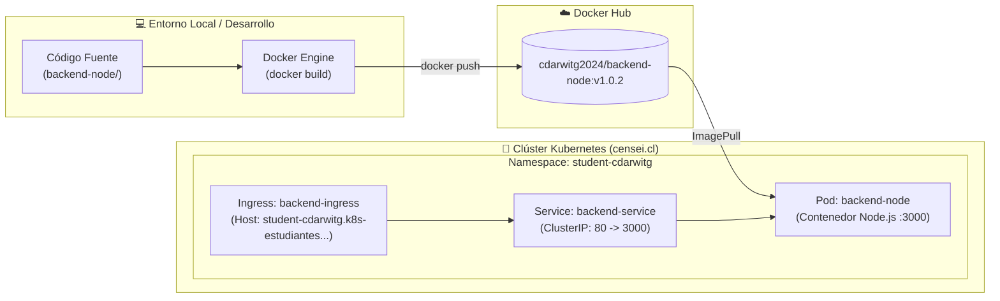

# Guía y Registro de Despliegue en Kubernetes (K8s)

Documento técnico que detalla el proceso de empaquetado (Docker), publicación en registro y despliegue del Backend de la Cafetería Universitaria (**CoffeeFast**) en el clúster de Kubernetes institucional.

---

## 📋 Resumen del Entorno

- **Clúster Kubernetes**: Infraestructura académica institucional (`dev.censei.cl`).
- **Namespace Asignado**: `student-cdarwitg`
- **Usuario Autenticado**: `ldap:cdarwitg` (mediante plugin `kubelogin / oidc-login`).
- **Imagen en Docker Hub**: `cdarwitg2024/backend-node:v1.0.2`
- **Host / Dominio Ingress**: `student-cdarwitg.k8s-estudiantes.dev.censei.cl`

---

## 🏗️ Arquitectura de Despliegue



---

## 1. Dockerización del Backend

Para empaquetar el servidor Node.js se configuró el archivo [`backend-node/Dockerfile`](../backend-node/Dockerfile):

```dockerfile
FROM node:20-alpine
WORKDIR /usr/src/app
COPY package*.json ./
RUN npm install
COPY . .
EXPOSE 3000
CMD ["node", "server.js"]
```

### Construcción y Publicación de la Imagen:
```bash
# 1. Construir la imagen Docker localmente
docker build -t cdarwitg2024/backend-node:v1.0.2 ./backend-node

# 2. Iniciar sesión en Docker Hub
docker login

# 3. Subir la imagen al registro público
docker push cdarwitg2024/backend-node:v1.0.2
```

---

## 2. Manifiestos de Kubernetes Aplicados

### A. Despliegue (`Deployment`)
Controla la ejecución del contenedor y garantiza que esté disponible de forma ininterrumpida:

```yaml
apiVersion: apps/v1
kind: Deployment
metadata:
  name: backend-node
  namespace: student-cdarwitg
  labels:
    app: backend-node
spec:
  replicas: 1
  selector:
    matchLabels:
      app: backend-node
  template:
    metadata:
      labels:
        app: backend-node
    spec:
      containers:
      - name: backend-node
        image: cdarwitg2024/backend-node:v1.0.2
        imagePullPolicy: IfNotPresent
        ports:
        - containerPort: 3000
```

### B. Servicio Interno (`Service`)
Expone internamente la aplicación en el puerto `80`, redirigiendo el tráfico al puerto `3000` del contenedor:

```yaml
apiVersion: v1
kind: Service
metadata:
  name: backend-service
  namespace: student-cdarwitg
spec:
  type: ClusterIP
  selector:
    app: backend-node
  ports:
  - port: 80
    targetPort: 3000
    protocol: TCP
```

### C. Enrutador Externo (`Ingress`)
Asigna el subdominio institucional público y redirige las peticiones al servicio:

```yaml
apiVersion: networking.k8s.io/v1
kind: Ingress
metadata:
  name: backend-ingress
  namespace: student-cdarwitg
spec:
  ingressClassName: nginx
  rules:
  - host: student-cdarwitg.k8s-estudiantes.dev.censei.cl
    http:
      paths:
      - path: /
        pathType: Prefix
        backend:
          service:
            name: backend-service
            port:
              number: 80
```

---

## 3. Pruebas y Verificación

### Estado de los Recursos en el Clúster:
Comando de verificación:
```powershell
$env:KUBECONFIG = "$HOME\Downloads\estudiantes-cdarwitg.kubeconfig"
kubectl get pods,services,ingress -n student-cdarwitg
```

Salida confirmada:
- **Pod**: `backend-node-xxxx` en estado **`Running`**.
- **Service**: `backend-service` en estado activo (puerto 80 ➔ 3000).
- **Ingress**: `backend-ingress` configurado hacia el host `student-cdarwitg.k8s-estudiantes.dev.censei.cl`.

### Prueba de Conectividad Local (`port-forward`):
Para verificar la respuesta directa del servicio desde el pod:
```powershell
kubectl port-forward svc/backend-service 8080:80 -n student-cdarwitg
```

Petición HTTP a `http://localhost:8080`:
```json
{
  "name": "Backend Cafetería Universitaria",
  "version": "1.0.0",
  "status": "online",
  "endpoints": {
    "health": "/health",
    "tiempos": "/api/tiempos",
    "qr": "/api/qr"
  }
}
```

---

## 4. Procedimiento para Futuras Actualizaciones

Cuando se implementen nuevas funcionalidades en el backend (por ejemplo, lógica de creación de pedidos o migración de módulos a NestJS), se debe seguir este ciclo:

1. **Efectuar cambios** en el código fuente.
2. **Incrementar versión y compilar imagen**:
   ```powershell
   docker build -t cdarwitg2024/backend-node:v1.0.3 ./backend-node
   docker push cdarwitg2024/backend-node:v1.0.3
   ```
3. **Actualizar el Pod en Kubernetes**:
   ```powershell
   kubectl set image deployment/backend-node backend-node=cdarwitg2024/backend-node:v1.0.3 -n student-cdarwitg
   # O forzar reinicio si se usa la misma etiqueta:
   kubectl rollout restart deployment backend-node -n student-cdarwitg
   ```
