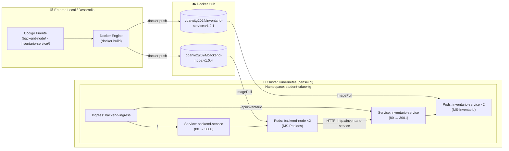

# Guía y Registro de Despliegue en Kubernetes (K8s)

Documento técnico que detalla el proceso de empaquetado (Docker), publicación en registro y despliegue del Backend de la Cafetería Universitaria (**CoffeeFast**) en el clúster de Kubernetes institucional.

> **Arquitectura de microservicios:** el sistema se despliega hoy como **2 microservicios**
> (`backend-node` y `inventario-service`) comunicados por HTTP. La explicación de por qué
> están separados, sus endpoints y los flujos de negocio están en
> [`arquitectura-microservicios.md`](./arquitectura-microservicios.md).

---

## 📋 Resumen del Entorno

- **Clúster Kubernetes**: Infraestructura académica institucional (`dev.censei.cl`).
- **Namespace Asignado**: `student-cdarwitg`
- **Usuario Autenticado**: `ldap:cdarwitg` (mediante plugin `kubelogin / oidc-login`).
- **Imágenes en Docker Hub**:
  - `cdarwitg2024/backend-node:v1.0.4` (MS-Pedidos)
  - `cdarwitg2024/inventario-service:v1.0.1` (MS-Inventario)
- **Host / Dominio Ingress**: `api-cdarwitg.dev.censei.cl` (publicado vía la anotación `external-dns.alpha.kubernetes.io/target: proxy.inf.uct.cl`)
- **Cupo de recursos del namespace**: 2 cores de CPU (se aplica sobre `limits.cpu`).

### Configuración de `kubectl`

`kubectl` no tiene un servidor que encender: solo necesita saber a qué clúster
apuntarle. Si devuelve `dial tcp [::1]:8080`, es que la terminal no tiene la
configuración cargada:

```powershell
# Opción rápida (solo esta terminal)
$env:KUBECONFIG = "$HOME\Downloads\estudiantes-cdarwitg.kubeconfig"

# Opción permanente (una sola vez, funciona en toda terminal)
New-Item -ItemType Directory -Force -Path "$HOME\.kube" | Out-Null
Copy-Item "$HOME\Downloads\estudiantes-cdarwitg.kubeconfig" "$HOME\.kube\config" -Force
```

---

## 🏗️ Arquitectura de Despliegue


```mermaid
flowchart LR
    subgraph Local ["💻 Entorno Local / Desarrollo"]
        Code["Código Fuente\n(backend-node/ · inventario-service/)"]
        Docker["Docker Engine\n(docker build)"]
    end

    subgraph Registry ["☁️ Docker Hub"]
        ImageP[("cdarwitg2024/backend-node:v1.0.4")]
        ImageI[("cdarwitg2024/inventario-service:v1.0.1")]
    end

    subgraph K8sCluster ["🏢 Clúster Kubernetes (censei.cl)"]
        subgraph Namespace ["Namespace: student-cdarwitg"]
            Ingress["Ingress: backend-ingress"]
            ServiceP["Service: backend-service\n(80 → 3000)"]
            ServiceI["Service: inventario-service\n(80 → 3001)"]
            PodP["Pods: backend-node ×2\n(MS-Pedidos)"]
            PodI["Pods: inventario-service ×2\n(MS-Inventario)"]
        end
    end

    Code --> Docker
    Docker -->|docker push| ImageP
    Docker -->|docker push| ImageI
    ImageP -->|ImagePull| PodP
    ImageI -->|ImagePull| PodI
    Ingress -->|"/"| ServiceP
    Ingress -->|"/api/inventario"| ServiceI
    ServiceP --> PodP
    ServiceI --> PodI
    PodP -->|"HTTP: http://inventario-service"| ServiceI
```

---

## 1. Dockerización de los servicios

[`backend-node/Dockerfile`](../backend-node/Dockerfile):

```dockerfile
FROM node:22-alpine
WORKDIR /usr/src/app
COPY package*.json ./
RUN npm install
COPY . .
EXPOSE 3000
CMD ["node", "server.js"]
```

[`inventario-service/Dockerfile`](../inventario-service/Dockerfile) es equivalente, con
`EXPOSE 3001` y `CMD ["node", "src/server.js"]`.

> **Node 22 es obligatorio:** `@supabase/supabase-js` requiere Node 22 o superior
> (sockets nativos). Con Node 20 el contenedor arranca y muere de inmediato con
> `Error: Node.js detected but native WebSocket not found`.

Ambos servicios tienen un `.dockerignore` que excluye `node_modules`, `.env` y `.git`:
sin esto, el `COPY . .` final incrustaría en la imagen las dependencias compiladas
para Windows y la clave de Supabase.

### Construcción y Publicación de las Imágenes:
```bash
# 1. Construir la imagen Docker localmente
docker build -t cdarwitg2024/backend-node:v1.0.4 ./backend-node
docker build -t cdarwitg2024/inventario-service:v1.0.1 ./inventario-service

# 2. Iniciar sesión en Docker Hub
docker login

# 3. Subir la imagen al registro público
docker push cdarwitg2024/backend-node:v1.0.4
docker push cdarwitg2024/inventario-service:v1.0.1
```

---

## 2. Manifiestos de Kubernetes Aplicados

Los manifiestos versionados están en [`k8s/`](../k8s). El Ingress también vive
dentro de `k8s/`, en [`k8s/ingress.yaml`](../k8s/ingress.yaml):

| Archivo | Recurso | Aplicar con |
|---|---|---|
| `k8s/pedidos/backend-deployment.yaml` | Deployment `backend-node` | `kubectl apply -f ...` |
| `k8s/pedidos/backend-service.yaml` | Service `backend-service` | `kubectl apply -f ...` |
| `k8s/inventario/inventario-deployment.yaml` | Deployment `inventario-service` | `kubectl apply -f ...` |
| `k8s/inventario/inventario-service.yaml` | Service `inventario-service` | `kubectl apply -f ...` |
| `k8s/ingress.yaml` | Ingress `backend-ingress` (1 ruta) | `kubectl apply -f ...` |

> **No uses `kubectl apply -f k8s/ --recursive`.** Aplica archivo por archivo o
> por subcarpeta (`k8s/pedidos`, `k8s/inventario`). Ver la advertencia de
> seguridad en el [README](../README.md).

> **No hay manifiesto de Secret en `k8s/`.** La plantilla de referencia está en
> [`docs/secrets/supabase-secret.example.yaml`](../docs/secrets/supabase-secret.example.yaml),
> fuera del árbol que se aplica, justamente para que un `apply` recursivo no
> pueda sobrescribir el Secret real del clúster.

### A. Despliegues (`Deployment`)
Controlan la ejecución de los contenedores y simmerán el número de réplicas:

```yaml
# backend-node (k8s/pedidos/backend-deployment.yaml)
spec:
  replicas: 1
  template:
    spec:
      containers:
      - name: backend-node
        image: cdarwitg2024/backend-node:v1.0.4
        ports:
        - containerPort: 3000
        envFrom:
        - secretRef:
            name: coffeesecret-supabase      # credenciales vía Secret
        env:
        - name: INVENTARIO_SERVICE_URL
          value: "http://inventario-service"  # acoplamiento por HTTP
        resources:
          requests: { cpu: 125m, memory: 128Mi }
          limits:   { cpu: 250m, memory: 256Mi }
        readinessProbe:                      # ¿puede recibir tráfico?
          httpGet: { path: /health, port: 3000 }
        livenessProbe:                       # ¿está vivo?
          httpGet: { path: /health, port: 3000 }
```

```yaml
# inventario-service (k8s/inventario/inventario-deployment.yaml)
spec:
  replicas: 1
  template:
    spec:
      containers:
      - name: inventario-service
        image: cdarwitg2024/inventario-service:v1.0.1
        ports:
        - containerPort: 3001
        envFrom:
        - secretRef:
            name: coffeesecret-supabase
        env:
        - name: PORT
          value: "3001"
        resources:
          requests: { cpu: 125m, memory: 128Mi }
          limits:   { cpu: 250m, memory: 256Mi }
        readinessProbe:
          httpGet: { path: /health, port: 3001 }
        livenessProbe:
          httpGet: { path: /health, port: 3001 }
```

### B. Servicios Internos (`Service`)
Expone cada aplicación en el puerto `80` y reparte el tráfico entre sus pods:

```yaml
# backend-service
spec:
  type: ClusterIP
  selector: { app: backend-node }
  ports: [{ port: 80, targetPort: 3000, protocol: TCP }]

# inventario-service
spec:
  type: ClusterIP
  selector: { app: inventario-service }
  ports: [{ port: 80, targetPort: 3001, protocol: TCP }]
```

### C. Secret de credenciales
Las credenciales de Supabase **no** se versionan. Se crean una vez en el clúster
(la plantilla está en
[`docs/secrets/supabase-secret.example.yaml`](../docs/secrets/supabase-secret.example.yaml)):

```powershell
kubectl create secret generic coffeesecret-supabase `
  --from-literal=SUPABASE_URL="https://<proyecto>.supabase.co" `
  --from-literal=SUPABASE_SERVICE_KEY="<service key>" `
  -n student-cdarwitg
```

### D. Escalado automático (`HPA`) — eliminado

El HPA de inventario **ya no se aplica**. El namespace no tiene `metrics-server`,
así que el HPA se quedaba en `cpu: <unknown>` y su `minReplicas: 2` pisaba el
`replicas` del Deployment. Las réplicas las controla `inventario-deployment.yaml`.

```yaml
# RETIRADO: k8s/inventario/inventario-hpa.yaml
# minReplicas: 2  ->  mantenía 2 pods vivos sin importar el Deployment
# metrics: cpu    ->  <unknown> porque no hay metrics-server
```

### E. Enrutador Externo (`Ingress`)
Asigna el subdominio institucional y publica **una sola ruta** (`/`) hacia
Pedidos. La anotación `external-dns.alpha.kubernetes.io/target` es la que publica
el host en el DNS público de la plataforma; sin ella el Ingress existe pero el
dominio no resuelve.

> **Por qué una sola ruta:** la `ValidatingAdmissionPolicy` `rke2-edu-ingress-hostname`
> de la plataforma rechaza cualquier path distinto de `/`
> (*"Cada hostname debe usar exclusivamente el path /"*). Mientras el syncer no
> pueda crear el Ingress en el clúster host, tampoco se crea el registro DNS, así
> que declarar `/api/inventario` dejaba el dominio sin resolver.

> **Inventario no se expone por el Ingress a propósito:** es una dependencia
> interna de Pedidos, que lo consume por HTTP con `INVENTARIO_SERVICE_URL`
> (ver [`backend-node/src/clients/inventario.client.js`](../backend-node/src/clients/inventario.client.js)).
> Dentro del clúster se llega como `http://inventario-service/api/inventario`.

```yaml
apiVersion: networking.k8s.io/v1
kind: Ingress
metadata:
  name: backend-ingress
  namespace: student-cdarwitg
  annotations:
    external-dns.alpha.kubernetes.io/target: proxy.inf.uct.cl
spec:
  ingressClassName: nginx
  rules:
  - host: api-cdarwitg.dev.censei.cl
    http:
      paths:
      - path: /
        pathType: Prefix
        backend:
          service: { name: backend-service, port: { number: 80 } }
```

---

## 3. Pruebas y Verificación

### Estado de los Recursos en el Clúster:
Comando de verificación:
```powershell
$env:KUBECONFIG = "$HOME\Downloads\estudiantes-cdarwitg.kubeconfig"
kubectl get deployments,services,ingress,hpa -n student-cdarwitg
kubectl get pods -n student-cdarwitg
```

Salida confirmada:
- **Deployments**: `backend-node 1/1` y `inventario-service 1/1`, ambos `Available`.
- **Pods**: 1 pod `Running` por servicio (réplicas fijadas en 1).
- **Services**: `backend-service` (80 ➔ 3000) e `inventario-service` (80 ➔ 3001).
- **Ingress**: 1 ruta (`/`) hacia `api-cdarwitg.dev.censei.cl`.
- **HPA**: eliminado (sin `metrics-server` en el namespace).

> **Pendiente con el profesor:** el DNS público de `api-cdarwitg.dev.censei.cl`
> todavía no resuelve. El Ingress está aplicado y correcto, pero el syncer de la
> plataforma lo reintenta cada ~13-16 min; hay que confirmar con el profesor si el
> registro ya se propagó o si hay que pedirlo.
>
> **Pendiente con el profesor:** el `Secret` apunta a un proyecto Supabase cloud
> que devuelve `NXDOMAIN`, así que todo endpoint que consulte la base de datos
> responde `500` (`/health` funciona porque no toca la BD). Hay que decidir a qué
> proyecto apunta el clúster.

### Prueba de Conectividad Local (`port-forward`):
Para consultar cada servicio desde el computador, sin depender del DNS público:

```powershell
kubectl port-forward svc/backend-service 8080:80 -n student-cdarwitg
kubectl port-forward svc/inventario-service 8081:80 -n student-cdarwitg
```

Respuesta de `GET http://localhost:8080/health` (MS-Pedidos):

```json
{
  "status": "OK",
  "service": "backend-cafeteria",
  "version": "1.0.0",
  "environment": "development"
}
```

Respuesta de `GET http://localhost:8081/health` (MS-Inventario):

```json
{
  "servicio": "inventario-service",
  "version": "1.0.0",
  "status": "healthy"
}
```

La prueba de que **ambos servicios se hablan** (crear un pedido por Pedidos y ver el
stock descontado por Inventario) está en
[`arquitectura-microservicios.md` § 8.2](./arquitectura-microservicios.md).

---

## 4. Procedimiento para Futuras Actualizaciones

Cuando se implementen nuevas funcionalidades, se sigue este ciclo **por servicio**:

1. **Efectuar cambios** en el código fuente.
2. **Correr los tests** del servicio afectado:
   ```powershell
   cd backend-node; npm test
   cd inventario-service; npm test
   ```
3. **Incrementar versión y compilar imagen**:
   ```powershell
   docker build -t cdarwitg2024/backend-node:v1.0.5 ./backend-node
   docker push cdarwitg2024/backend-node:v1.0.5
   ```
4. **Actualizar los Pods en Kubernetes**:
   ```powershell
   kubectl set image deployment/backend-node backend-node=cdarwitg2024/backend-node:v1.0.5 -n student-cdarwitg
   kubectl rollout status deployment/backend-node -n student-cdarwitg
   # O forzar reinicio si se usa la misma etiqueta:
   kubectl rollout restart deployment/backend-node -n student-cdarwitg
   ```
5. **Verificar**:
   ```powershell
   kubectl get pods -n student-cdarwitg
   kubectl logs deployment/backend-node -n student-cdarwitg --tail=20
   ```

### Problemas frecuentes

| Síntoma | Causa | Solución |
|---|---|---|
| `dial tcp [::1]:8080` | `kubectl` sin kubeconfig cargado | Ver *Configuración de kubectl* |
| `Error: Node.js detected but native WebSocket not found` | Imagen construida con Node 20 | `FROM node:22-alpine` y reconstruir |
| `Advertencia: Faltan SUPABASE_URL o SUPABASE_KEY` | El Deployment no tiene `envFrom` con el Secret | `kubectl apply -f k8s/pedidos/backend-deployment.yaml` |
| `exceeded quota: student-provisioner-quota` | Se agotó el cupo de 2 cores de CPU | Reducir réplicas o bajar `limits.cpu` de los manifiestos |
| `CrashLoopBackOff` con `supabaseUrl is required` | Sin credenciales en el pod | Verificar Secret y `envFrom` |

