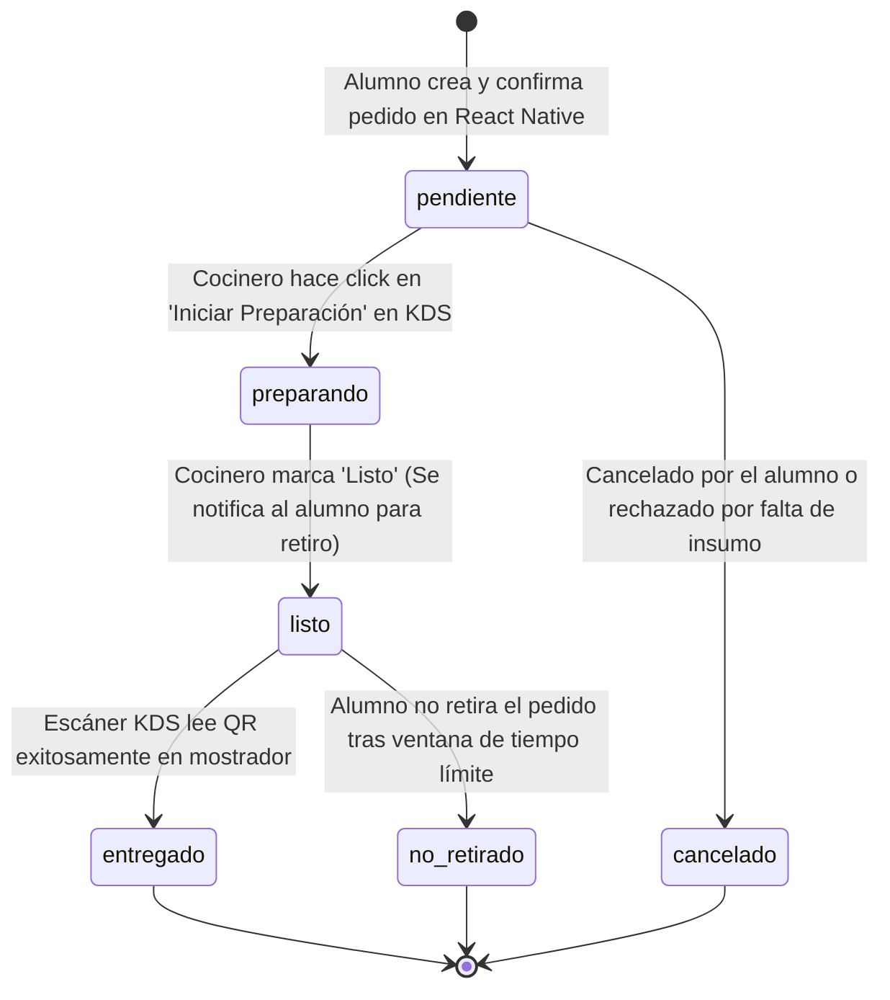

# Flujo de Integración y Conexión de Apps

Documento técnico descriptivo de la arquitectura de integración, flujo de datos, ciclo de vida de pedidos y puntos críticos de consistencia para la plataforma de pedidos de cafeterías universitarias.

---

## 🛠️ Stack Tecnológico Definido

- **📱 App Móvil**: React Native (TypeScript) – Aplicación para estudiantes (catálogo, pedidos, pago, visualización de QR y seguimiento en vivo).
- **🚀 Orquestador de API**: NestJS (TypeScript) – Backend modular (validaciones con DTOs, emisión segura de tokens QR, lógica de pagos y coordinación de reglas de negocio).
- **🗄️ Base de Datos & BaaS**: Supabase (PostgreSQL, Supabase Auth, Supabase Realtime / WebSockets, Storage).
- **💻 App Desktop**: React + Vite + Electron + MUI – Sistema de Cocina (**KDS** + **Escáner QR**) y **Panel de Dueño** (Dashboard y Analíticas con Recharts).

---

## 1. Arquitectura General y Flujos de Conexión

```mermaid
flowchart TB
    subgraph Clientes ["📱 Dispositivos Móviles"]
        RN["App Móvil (React Native)\nEstudiante"]
    end

    subgraph BackendLayer ["🚀 Capa de Orquestación y Datos"]
        Nest["Orquestador NestJS\n(Lógica de negocio, DTOs, Tokens QR, Pagos)"]
        Supa[("Supabase\nPostgreSQL + Auth + Realtime")]
    end

    subgraph DesktopLayer ["💻 Aplicación Escritorio (React + Electron)"]
        KDS["KDS - Pantalla de Cocina\n& Lector / Escáner QR"]
        Owner["Panel de Dueño\nDashboard, Métricas & Gestión"]
    end

    %% Flujo Móvil
    RN -->|1. Autenticación JWT| Supa
    RN -->|2. Crear pedido / Checkout| Nest
    Nest -->|3. Valida & Persiste pedido y QR Token| Supa
    Supa -.->|4. Notifica cambios de estado en vivo (WebSocket)| RN

    %% Flujo KDS
    Supa -.->|5. Transmite nuevo pedido en tiempo real| KDS
    KDS -->|6. Iniciar preparación / Marcar Listo| Supa
    KDS -->|7. Escanea QR y Valida Entrega| Nest
    Nest -->|8. Actualiza a 'entregado' con atomicidad| Supa

    %% Flujo Panel Dueño
    Supa -->|9. Consulta KPIs, Ventas y Métricas| Owner
    Owner -->|10. Actualiza stock, menú y disponibilidad| Supa
```

---

### A. Flujo Operativo: `App Móvil (React Native) ↔ Supabase ↔ KDS (Electron)`

Este flujo cubre la experiencia del pedido desde su creación hasta la entrega física en mostrador:

1. **Creación de la Orden**:
   - El estudiante inicia sesión en la App Móvil usando Supabase Auth.
   - Selecciona productos y envía la solicitud de creación de orden al **Orquestador NestJS** (`POST /api/v1/pedidos`).
   - NestJS valida las reglas de negocio (precios, stock disponible mediante DTOs) y genera un **`qr_token`** seguro (UUIDv4 o JWT firmado).
   - NestJS inserta la cabecera en `PEDIDOS` y las líneas en `DETALLES_PEDIDO` en Supabase.
2. **Recepción en Cocina (KDS)**:
   - La pantalla KDS en la cafetería mantiene abierta una suscripción WebSockets con Supabase Realtime:
     ```typescript
     supabase
       .channel('kds-pedidos')
       .on('postgres_changes', {
         event: 'INSERT',
         schema: 'public',
         table: 'PEDIDOS',
         filter: `cafeteria_id=eq.${currentCafeteriaId}`
       }, payload => agregarNuevaComanda(payload.new))
       .subscribe();
     ```
   - La comanda aparece automáticamente en el tablero KDS con estado **`pendiente`**.
3. **Procesamiento en Cocina**:
   - El operador pulsa "Iniciar Preparación" en el KDS ➔ Estado pasa a **`preparando`** (se guarda `inicio_preparacion_en`).
   - Al terminar de empaquetar, el operador pulsa "Marcar Listo" ➔ Estado pasa a **`listo`**.
   - A través del WebSocket de Supabase, la App Móvil del estudiante se actualiza instantáneamente e instruye al alumno: *"¡Tu pedido está listo para retiro! Muestra tu código QR en el mostrador"*.
4. **Validación y Retiro**:
   - La App Móvil renderiza el código QR mediante `react-native-qrcode-svg` codificando el `qr_token`.
   - El personal de cafetería escanea el código en la pantalla del KDS (usando la cámara integrada o lector óptico).
   - El KDS envía el token al endpoint de validación de NestJS (`POST /api/v1/pedidos/validar-qr`).
   - NestJS valida la vigencia y unicidad del token, actualiza el pedido a **`entregado`**, fija la marca `completado_en` y calcula el `tiempo_real_min`.
   - El KDS muestra confirmación de éxito y remueve la comanda del tablero activo.

---

### B. Flujo Administrativo: `App Móvil (React Native) ↔ Supabase ↔ Panel Dueño (Electron)`

Este flujo cubre la gestión de catálogo, inventario y la analítica comercial del negocio:

1. **Generación Continua de Datos**:
   - Cada pedido generado por los estudiantes en React Native y completado por el personal acumula registros históricos en Supabase: montos, horarios, productos vendidos y tiempos reales de preparación.
2. **Consumo de Analíticas (Dashboard)**:
   - El **Panel de Dueño** consulta vistas y funciones de agregación en Supabase para desplegar métricas en tiempo real con Recharts:
     - Ventas totales del día ($ CLP).
     - Curva de demanda de pedidos por hora (para prever horas punta en el campus).
     - Tiempos promedio de espera y preparación.
     - Top productos más vendidos.
3. **Gestión Inversa (Configuración y Stock hacia los Clientes)**:
   - El dueño modifica precios, agrega nuevos productos o marca un ítem como agotado (`activo = false` o `stock = 0`) desde el Panel de Escritorio.
   - Supabase propaga estos cambios o los entrega en la siguiente consulta REST de la App Móvil, impidiendo que los alumnos compren ítems sin disponibilidad.

---

## 2. Datos que Genera cada Interfaz (Outputs)

| Interfaz / Capa | Datos que Genera | Destino |
| :--- | :--- | :--- |
| **📱 App Móvil (React Native)** | - Credenciales de registro/login (`email`, `password`, `nombre`, `telefono`, `campus_sede_id`).<br>- Solicitud de pedido: `cafeteria_id`, `metodo_pago`, `ubicacion_entrega`, `notas_estudiante`.<br>- Líneas del pedido (`detalles`): `producto_id`, `cantidad`, `modificaciones` (ej. *"sin azúcar, leche de soya"*).<br>- Solicitud de cancelación previa (si el estado continúa en `pendiente`). | Supabase Auth<br>Orquestador NestJS (`/pedidos`) |
| **🚀 Orquestador NestJS** | - `qr_token` unívoco y no secuencial (UUIDv4 o JWT firmado).<br>- Cálculo validado de montos (`subtotal`, `descuentos`, `total`).<br>- Timestamps de auditoría (`creado_en`, `expira_en`).<br>- Registro de transacción de pago asociada. | Supabase (`PEDIDOS`, `DETALLES_PEDIDO`, `PAGOS`) |
| **🍳 KDS (Cocina & Escáner)** | - Actualización de estado a `preparando` + marca de tiempo `inicio_preparacion_en`.<br>- Actualización de estado a `listo`.<br>- Lectura de código QR escaneado por cámara / input óptico.<br>- Actualización de estado a `entregado` + marca `completado_en` + `tiempo_real_min`.<br>- Registros en `LOGS_VALIDACION_QR` (éxito, token duplicado, token inválido). | Supabase (`PEDIDOS`)<br>Orquestador NestJS (`/validar-qr`) |
| **📊 Panel Dueño (Dashboard)** | - Modificaciones de productos (nombre, descripción, categoría, precio, imagen, estado `activo`).<br>- Ajustes de inventario (ingreso/egreso de stock).<br>- Configuración de cafetería (horarios de atención, estado abierta/cerrada, tiempo base de espera).<br>- Generación y exportación de reportes PDF de ventas. | Supabase (`PRODUCTOS`, `INVENTARIO`, `CAFETERIAS`) |

---

## 3. Datos que Consume cada Interfaz (Inputs)

| Interfaz / Capa | Datos que Consume | Origen |
| :--- | :--- | :--- |
| **📱 App Móvil (React Native)** | - Lista de cafeterías activas con estado (abierta/cerrada) y tiempos estimados de espera.<br>- Catálogo de menú filtrado por categoría con precios vigentes, fotos y stock disponible.<br>- Confirmación del pedido y recepción del `qr_token` para renderizar el QR.<br>- Transiciones de estado del pedido en tiempo real vía WebSockets (`pendiente` ➔ `preparando` ➔ `listo` ➔ `entregado`).<br>- Historial de pedidos anteriores del estudiante. | Supabase (PostgREST & Realtime)<br>Orquestador NestJS |
| **🍳 KDS (Cocina & Escáner)** | - Eventos `INSERT` de nuevos pedidos filtrados por `cafeteria_id`.<br>- Lista de comandas en preparación ordenadas cronológicamente (FIFO).<br>- Desglose de cada comanda: cantidad, nombre de producto, notas de personalización y tiempo transcurrido.<br>- Datos del pedido consultado al escanear el QR: nombre del estudiante, lista de verificación física y validación de seguridad. | Supabase Realtime (`PEDIDOS`, `DETALLES_PEDIDO`)<br>Orquestador NestJS |
| **📊 Panel Dueño (Dashboard)** | - Métricas acumuladas: Ventas del día, total de pedidos, tasa de pedidos entregados vs cancelados.<br>- Series temporales para gráficos: ventas y pedidos por franja horaria.<br>- Tiempo promedio real de preparación (`completado_en - inicio_preparacion_en`).<br>- Ranking de productos con mayor margen y volumen de ventas.<br>- Alertas de inventario bajo o quiebre de stock. | Supabase (Vistas y Consultas SQL Agregadas) |

---

## 4. Estados del Pedido (Máquina de Estados)



### Detalle de cada Estado:

1. **`pendiente`**:
   - **Disparador**: Estudiante realiza el checkout en React Native y NestJS confirma la transacción.
   - **Efecto**: Se asigna `qr_token`. La comanda ingresa a la lista del KDS resaltada en color rojo o con aviso sonoro.
   - **Cancelación**: Es el único estado en el que el estudiante puede cancelar la orden con reembolso automático.
2. **`preparando`**:
   - **Disparador**: El personal de cocina pulsa "Preparar" en el KDS.
   - **Efecto**: Se registra `inicio_preparacion_en = NOW()`. En la App Móvil el indicador cambia a naranja con mensaje de preparación en curso.
3. **`listo`**:
   - **Disparador**: El personal finaliza el armado y pulsa "Listo para Retiro" en el KDS.
   - **Efecto**: La App Móvil emite notificación (Push / Realtime) con fondo azul/verde: *"Tu pedido está en el mostrador. Presenta este código QR"*.
4. **`entregado`**:
   - **Disparador**: El escáner del KDS lee el QR en el teléfono del alumno y valida el `qr_token` vía NestJS.
   - **Efecto**: Se registra `completado_en = NOW()`, se calcula `tiempo_real_min = (completado_en - inicio_preparacion_en)`. La comanda desaparece del tablero activo del KDS y pasa al historial de ventas.
5. **`cancelado` / `no_retirado`** *(Excepciones)*:
   - Cancelado anticipadamente o cerrado por exceder el tiempo de retiro en mostrador.

---

## 5. Identificadores Necesarios (IDs Clave)

1. **`pedido_id`** *(UUID o identificador amigable único ej. `#1264-D`)*:
   - Identifica unívocamente la comanda para trazabilidad entre la App Móvil, KDS, tickets y base de datos.
2. **`qr_token`** *(UUIDv4 criptográfico / JWT con TTL)*:
   - **Esencial para la seguridad**: El valor secreto que se codifica dentro de la imagen QR.
   - **Regla estricta**: Nunca debe coincidir con el ID numérico secuencial del pedido ni ser predecible, evitando que usuarios malintencionados retiren pedidos ajenos adivinando números.
3. **`cafeteria_id`** *(UUID / INT)*:
   - Permite el aislamiento multi-tienda (multi-tenant). El KDS y el Panel Dueño solo reciben y manipulan datos de su propia cafetería.
4. **`usuario_id`** *(UUID generado por Supabase Auth)*:
   - Identifica al estudiante autenticado. Permite aplicar **Row Level Security (RLS)** para que ningún alumno consulte pedidos o datos privados de otros.
5. **`producto_id`** *(UUID / INT)*:
   - Conecta los ítems solicitados con la tabla de productos e inventario.
6. **`detalle_pedido_id`** *(UUID / INT)*:
   - Llave primaria de cada fila en `DETALLES_PEDIDO`.
7. **`dispositivo_id` / `terminal_id`**:
   - Identificador del terminal KDS o escáner que efectuó la validación física del QR (para auditoría).

---

## 6. Puntos de Inconsistencia y Estrategias de Mitigación

### ⚠️ A. Doble Escaneo de QR (*Double-Spend* / Condición de Carrera)
- **Riesgo**: Dos operadores escanean el mismo QR al mismo tiempo, o un lector óptico envía dos pulsos repetidos en milisegundos, disparando dos llamadas simultáneas de entrega.
- **Mitigación**:
  - NestJS o Supabase deben ejecutar una **transacción atómica con bloqueo condicional**:
    ```sql
    UPDATE "PEDIDOS"
    SET estado = 'entregado', completado_en = NOW()
    WHERE qr_token = $1 AND estado = 'listo'
    RETURNING id;
    ```
  - Si la consulta retorna 0 filas afectadas, NestJS rechaza la petición con código `409 Conflict` indicando: *"El código QR ya fue utilizado o el pedido no está listo para entrega"*.

---

### ⚠️ B. Pérdida de Conexión a Internet en la Cafetería (KDS Offline)
- **Riesgo**: Si la red WiFi de la cafetería experimenta microcortes, el KDS podría dejar de recibir nuevas comandas o no poder validar QRs en el mostrador.
- **Mitigación**:
  - Configurar en el cliente Supabase de Electron el mecanismo de **heartbeat y reconexión automática**.
  - Si se requiere validación sin conexión (Edge-Offline), el `qr_token` puede emitirse como un **JWT firmado asimétricamente (RS256)** por NestJS que contenga `{ pedido_id, cafeteria_id, exp }`. El KDS puede validar la firma de forma local usando la clave pública, encolando la actualización para cuando vuelva la red.

---

### ⚠️ C. Venta sin Stock Concurrente (*Phantom Stock*)
- **Riesgo**: Dos alumnos añaden el último croissant disponible al mismo tiempo en React Native y pagan con un segundo de diferencia.
- **Mitigación**:
  - La reserva y descuento de stock debe realizarse en NestJS dentro de una transacción PostgreSQL utilizando `SELECT ... FOR UPDATE` sobre la fila del producto/inventario.
  - Si el stock resultante es menor a cero, la transacción aborta (Rollback) y la App Móvil muestra una alerta amistosa: *"Lo sentimos, el producto acaba de agotarse"*.

---

### ⚠️ D. Distorsión Histórica por Cambio de Precios en el Menú
- **Riesgo**: Si el dueño sube el precio de un sándwich a las 14:00, y el Dashboard o el KDS calculan métricas cruzando simplemente `DETALLES_PEDIDO.producto_id` con `PRODUCTOS.precio`, las ventas de la mañana se inflarán retroactivamente de manera errónea.
- **Mitigación**:
  - La tabla `DETALLES_PEDIDO` debe guardar obligatoriamente una columna estática **`precio_unitario_historico`** con el precio congelado al instante exacto de compra, desacoplándola de futuros cambios en la tabla de catálogo.

---

### ⚠️ E. Suspensión de la App Móvil en Segundo Plano (*Doze Mode*)
- **Riesgo**: El cocinero cambia el pedido a `listo`, pero el alumno tiene el teléfono en el bolsillo con la pantalla apagada. El sistema operativo congela los WebSockets de React Native y el alumno nunca se entera de que su pedido está listo.
- **Mitigación**:
  - No depender exclusivamente de WebSockets para notificaciones críticas.
  - Implementar un disparador (Database Webhook o evento en NestJS) que, al transicionar a `listo`, envíe una **Notificación Push nativa (Firebase Cloud Messaging / APNs)** al token del dispositivo del estudiante.

---

### ⚠️ F. Saltos Ilegales en la Máquina de Estados
- **Riesgo**: Un bug en el cliente intenta marcar un pedido `pendiente` directamente como `entregado` sin pasar por cocina, o reabrir un pedido `entregado` a `preparando`.
- **Mitigación**:
  - En NestJS o mediante un Trigger/Constraint en PostgreSQL, validar estrictamente la matriz de transición permitida:
    - `pendiente` ➔ `preparando` o `cancelado`.
    - `preparando` ➔ `listo`.
    - `listo` ➔ `entregado` o `no_retirado`.
  - Cualquier otra transición arroja `400 Bad Request: Transición de estado no válida`.
